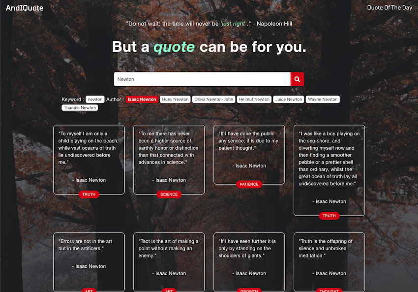

# AndIQuote

A quote searching application. Users can search for quotes or get quote of the day, and make a good-for-sharing image with awesome photos.

This is an API hack capstone project of Bloc web deeloper track program.

## Live

- [Live Page](https://asching7108.github.io/AndIQuote/)

## Features

* Search for quotes by keyword/author/tag
* Search for quote of the day by date
* Add random background image to the quote 
* Download the quote image

## Screenshots

Homepage / Find Quotes:

Quote of the Day: 

The Quote Just Right:

## Built With

* HTML
* CSS
* JavaScript
* jQuery

## API

- [Unsplash](https://unsplash.com/developers/)
- [FavQs](https://favqs.com/api/)
